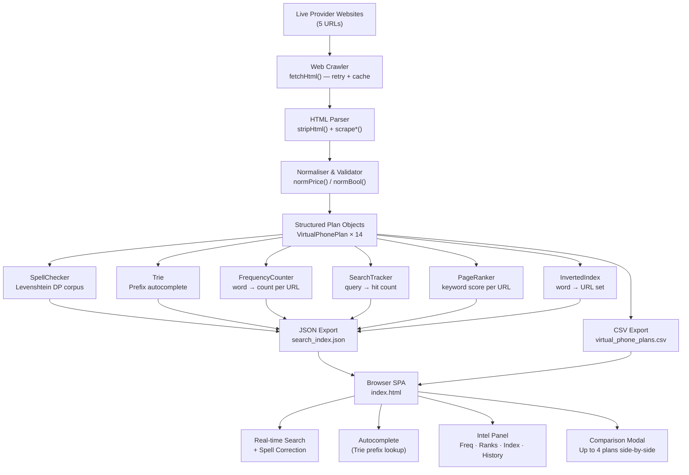
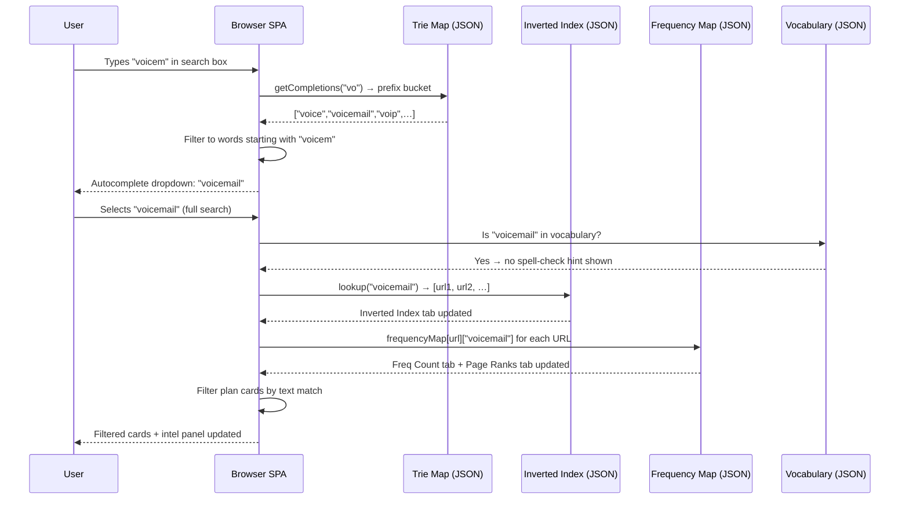

# System Architecture

## Overview

VoiceCompare is a two-stage system: a **Java data pipeline** that crawls, parses, and exports provider plan data; and a **browser SPA** that consumes the exported data to deliver real-time search, filtering, and comparison with no backend server.

```
┌─────────────────────────────────────────────────────────────────┐
│                     Java Data Pipeline                          │
│                 (src/VirtualPhoneScraperSuite.java)             │
└─────────────────────────────────────────────────────────────────┘
            │
            ▼
┌───────────────────────┐
│   1. Web Crawler      │  HTTP/1.1 client, exponential-backoff retry,
│   fetchHtml()         │  24h TTL file cache, stale-cache fallback
└──────────┬────────────┘
           │  raw HTML bytes
           ▼
┌───────────────────────┐
│   2. HTML Parser      │  Regex tag-stripping, entity decoding,
│   stripHtml()         │  structural table extraction per provider
│   scrape*()           │
└──────────┬────────────┘
           │  plain text + structured fields
           ▼
┌───────────────────────┐
│   3. Normalisation    │  normPrice() — canonical "$X/unit" format
│      & Validation     │  normBool()  — Yes | No | Add-on | N/A
│   (Algorithm 9 & 10)  │
└──────────┬────────────┘
           │  validated VirtualPhonePlan objects
           ▼
┌──────────────────────────────────────────────────────────────┐
│                  Data Structure Population                   │
│                                                              │
│   SpellChecker   ← vocabulary from corpus (Req 3)           │
│   Trie           ← all words for autocomplete (Req 4)        │
│   FrequencyCounter← per-URL word counts (Req 5)             │
│   SearchTracker  ← query hit-count log (Req 6)              │
│   PageRanker     ← keyword → URL ranking (Req 7)            │
│   InvertedIndex  ← word → URL set (Req 8)                   │
└──────────────────────────────────────────────────────────────┘
           │
    ┌──────┴──────┐
    │             │
    ▼             ▼
┌────────┐   ┌────────────────────┐
│  CSV   │   │   JSON Index       │
│  14×44 │   │   (550 KB)         │
└────────┘   └────────────────────┘
    │                 │
    └────────┬────────┘
             ▼
┌─────────────────────────────────────────────────────────────────┐
│               Browser SPA  (index.html)                         │
│                                                                 │
│  ┌──────────────┐  ┌──────────────┐  ┌──────────────────────┐  │
│  │ CSV Parser   │  │ Trie Lookup  │  │  Levenshtein (JS)    │  │
│  │ (RFC-4180)   │  │ Autocomplete │  │  Spell suggestions   │  │
│  └──────────────┘  └──────────────┘  └──────────────────────┘  │
│  ┌──────────────┐  ┌──────────────┐  ┌──────────────────────┐  │
│  │ InvIndex     │  │ FreqCounter  │  │  PageRanker          │  │
│  │ URL lookup   │  │ Word counts  │  │  Sort by rank        │  │
│  └──────────────┘  └──────────────┘  └──────────────────────┘  │
└─────────────────────────────────────────────────────────────────┘
```

---

## Mermaid Diagram



---

## Component Descriptions

### Java Pipeline (`src/VirtualPhoneScraperSuite.java`)

Single-file architecture for zero-dependency compilation. All components are `static` inner classes of the top-level `VirtualPhoneScraperSuite` class.

| Component | Class | Responsibility |
|---|---|---|
| Web Crawler | `fetchHtml()` | HTTP fetch with retry, disk cache, fallback |
| HTML Parser | `stripHtml()`, `scrape*()` | Tag stripping, entity decode, table extraction |
| Spell Checker | `SpellChecker` | Levenshtein DP, vocabulary from corpus |
| Autocomplete | `Trie` | Prefix tree, DFS traversal, flat-map export |
| Frequency Counter | `FrequencyCounter` | Per-URL word → count map |
| Search Tracker | `SearchTracker` | Query → hit count, serialised to JSON |
| Page Ranker | `PageRanker` | Keyword frequency scoring across pages |
| Inverted Index | `InvertedIndex` | word → sorted URL set, O(1) lookup |
| Data Model | `VirtualPhonePlan` | 44-field POJO, CSV serialisation |
| CSV Writer | `writeCSV()` | RFC-4180 compliant CSV output |
| JSON Writer | `writeSearchIndex()` | Manual JSON serialisation (no library) |

### Frontend (`index.html`)

Single-file SPA. Loads two files via `fetch()`:
- `data/virtual_phone_plans.csv` — plan cards
- `data/search_index.json` — all algorithm outputs for the intel panel

No build step, no framework, no transpilation. Runs from any static file server.

---

## Data Flow: Search Query



---

## File Layout

```
voicecompare/
├── src/VirtualPhoneScraperSuite.java   Java pipeline (~1 200 lines)
├── index.html                          Frontend SPA (~1 120 lines)
├── data/
│   ├── virtual_phone_plans.csv         14 rows × 44 columns (~10 KB)
│   └── search_index.json               all data structures (~550 KB)
├── docs/
│   ├── architecture.md                 ← you are here
│   ├── algorithms.md
│   ├── design-decisions.md
│   └── performance.md
├── tests/VoiceCompareSuiteTest.java    35 assertions, no JUnit
├── scripts/                            build.bat, run-scraper.bat, serve.bat
└── .github/
    ├── workflows/ci.yml                compile + test on push
    └── ISSUE_TEMPLATE/
```
